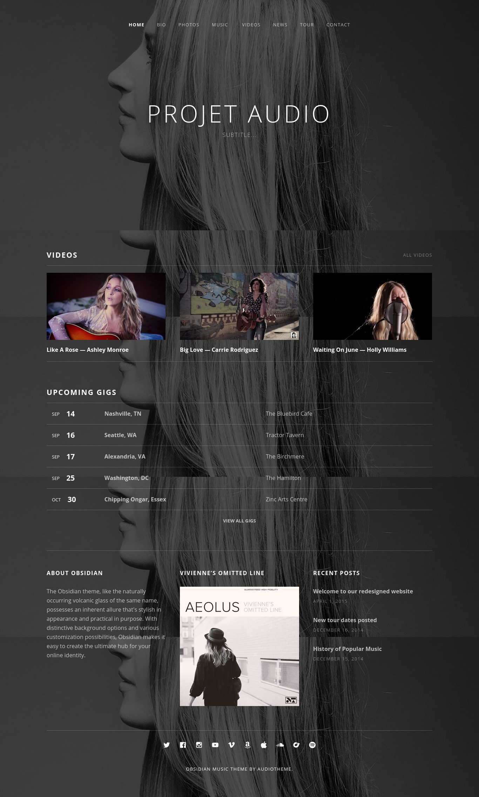

#### Simplon - Projet de fin de formation Game of Codes

##### Mission
~~~
Réalisation du blog d'un groupe de musique
~~~

##### Cahier des charges
* Intégration de la Home Page du blog en vous basant sur la maquette “Obsidian”
* Un effet “smooth scroll” à coder en JS pur ou à ajouter en jquery
* Un back-end en Ruby on Rails (+ 2e version en Meteor.js) pour ajouter les articles de votre blog
    - Les utilisateurs devront pouvoir :
        - Modifier et supprimer un article
        - Avoir un accès à l'admin du site. Vous pouvez au choix protéger cet accès avec un mdp ou avec un système de compte.
        
##### Consignes
* Respect des codes couleurs utilisés dans la mquette ainsi que les mesures
* Affichage de la page sur toute la largeur de l'écran
* Image de fond fixe et prend tout l'espace sans déformation
* Gestion des icônes des réseaux sociaux avec la biblothèque Font Awesome
* Gestion de la police de caractères avec Google Fonts "Open Sans" (Light, Normal, Bold SemiBold)
* Blog en RD (Responsive Design) : petits écrans, tablettes et smartphones
* Affichage parfait sur les dernières versions de Chrome et Firefox

-> **Défis perso** :   
* utiliser en la technologie **_"Flexbox"_** pour la mise en page 
* ajout d'un bouton Scroll to top (Retour en haut de page)

##### Rendu visuel attendu

